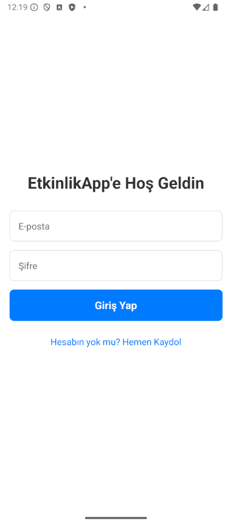
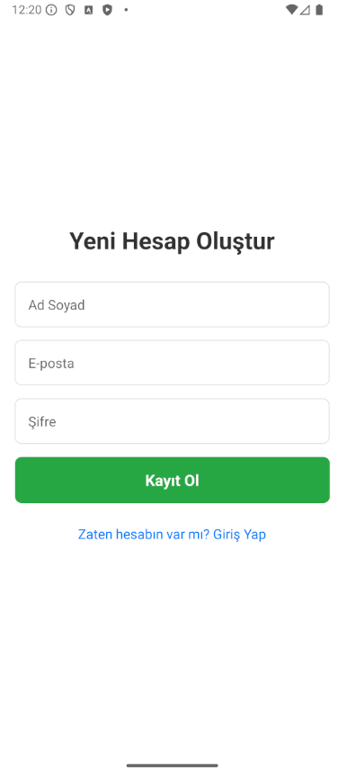
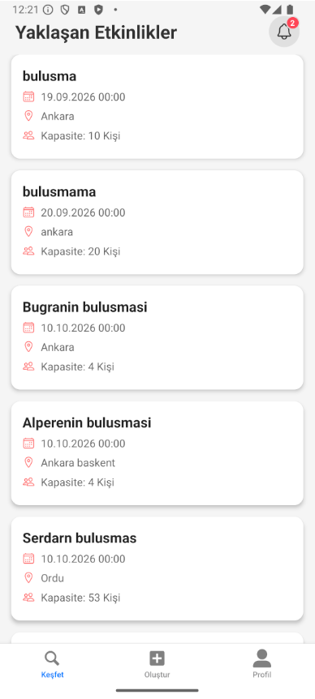
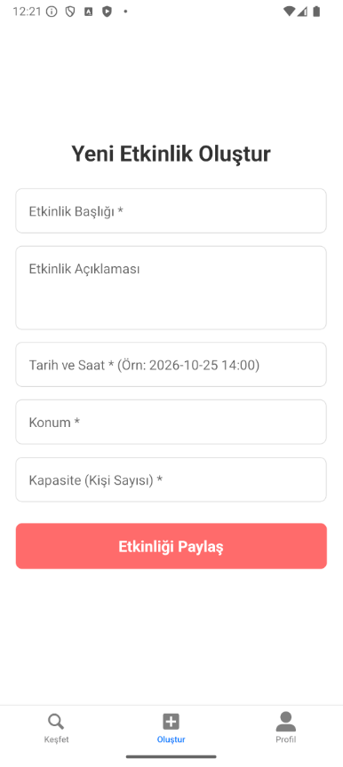
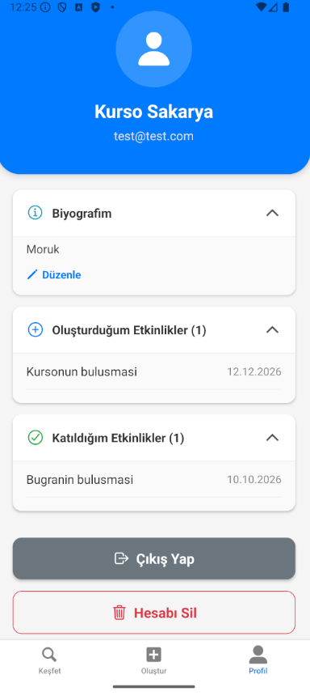
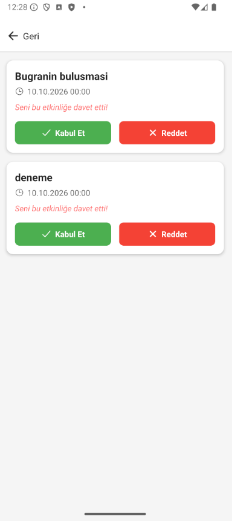
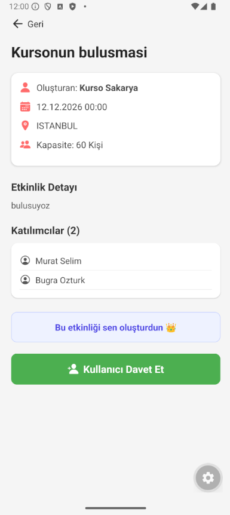
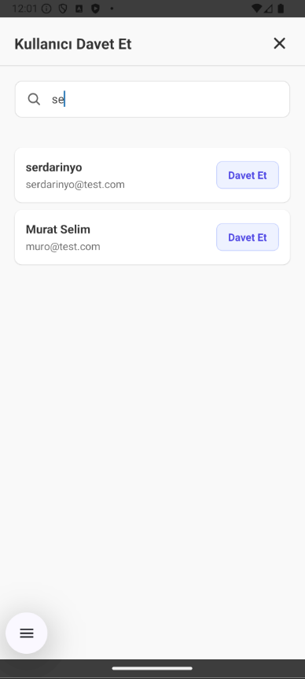
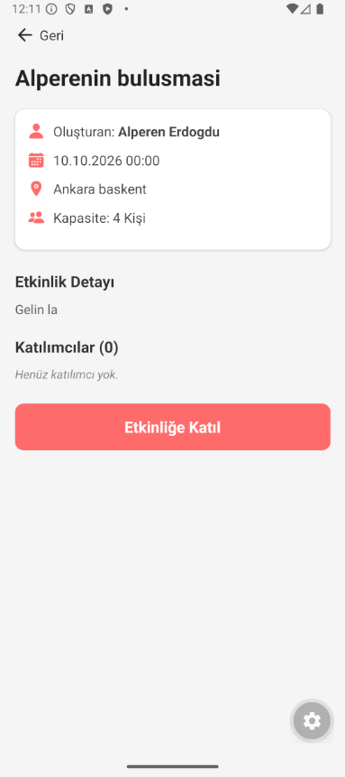

# EtkinlikApp 🎉

Sosyal topluluklar için geliştirilmiş, kullanıcıların kendi etkinliklerini oluşturabileceği, yeni etkinlikler keşfedip katılabileceği ve arkadaşlarını davet edebileceği yeni nesil mobil etkinlik uygulaması. 

Bu proje, "Spec-Driven Development" (Spesifikasyon Odaklı Geliştirme) yaklaşımı kullanılarak baştan uca tasarlanmış ve kodlanmıştır.

## 📱 Ekran Görüntüleri

| Giriş Ekranı | Giriş Yap Ekranı | Kayıt Ekranı | Keşfet |
| :---: | :---: | :---: | :---: |
|  |  |  |  |

| Etkinlik Oluşturma Ekranı | Profil Ekranı | Bildirimler Ekranı | 
| :---: | :---: | :---: | 
|  |  | |

| Buluşma Detayları | Davet Ekranı |  Ekranı | 
| :---: | :---: | :---: | 
|  |  | |

## ✨ Temel Özellikler

* **Kimlik Doğrulama:** Supabase Auth ile güvenli e-posta ve şifre kayıt/giriş işlemleri.
* **Etkinlik Yönetimi:** Yeni etkinlik oluşturma, kapasite, tarih ve konum belirleme.
* **Keşfet & Katıl:** Yaklaşan etkinlikleri listeleme ve tek tıkla katılım sağlama.
* **Davet Sistemi:** Sistemdeki diğer kullanıcıları arama ve etkinliklere özel davet gönderme.
* **Bildirimler:** Gelen davetleri uygulama içi bildirim zili ve rozet (badge) sistemiyle takip edip kabul veya reddetme.
* **Profil Yönetimi:** Kişiselleştirilebilir biyografi, oluşturulan ve katılım sağlanan etkinliklerin geçmişi, hesap silme.

## 🛠️ Kullanılan Teknolojiler

* **Frontend (Mobil):** React Native, Expo, Expo Router
* **Backend & Veritabanı:** Supabase (PostgreSQL)
* **Güvenlik:** Row Level Security (RLS)
* **Tasarım:** React Native StyleSheet, Ionicons
