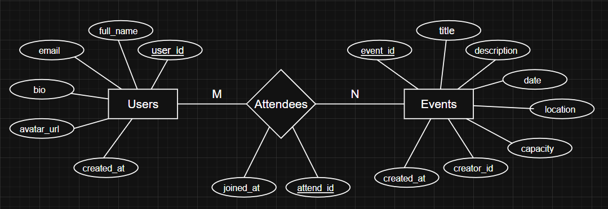
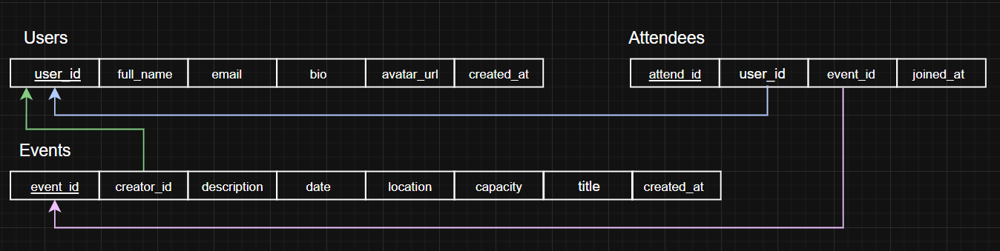

## Requirements

## 1.1 Kullanıcı Hikayeleri (User Stories)

* **Kayıt ve Giriş:** Bir kullanıcı olarak, uygulamaya kayıt olup giriş yapabilmek istiyorum, böylece etkinliklerimi kendi hesabım üzerinden güvenle yönetebilirim.
* **Profil Yönetimi:** Bir kullanıcı olarak, kişisel profilimi (isim, avatar, kısa bilgi) oluşturup düzenleyebilmek istiyorum, böylece topluluktaki diğer insanlar beni tanıyabilir.
* **Etkinlik Oluşturma:** Bir kullanıcı olarak; başlık, açıklama, tarih, saat ve konum bilgilerini girerek yeni bir etkinlik oluşturabilmek istiyorum, böylece katılımcılar buluşma detaylarını net bir şekilde öğrenebilir.
* **Davet Etme:** Bir kullanıcı olarak etkinliğime link veya kod ile arkadaşlarımı davet edebiliyor olamılıyım ki arkadaşlarım etkinliğimden uygulama üzerinden haberleri olsun. 
* **Etkinlik Arama** Bir kullanıcı olarak etkinlikleri net bir şekilde sıralayabilmeli, arayabilmeli ve de filteleyebilmeliyim. böylece bir etkinlik aradığım etkinlikleri rahatlıkla bulabileyim.
* **Detayları Görebilme** Bir kullanıcı olarak etkinlik detaylarını görebilmeliyim. Böylece olası karmaşıklıkları önleyebilelim. 
* **Katılım İsteği Gönderme** Bir kullanıcı olarak istediğim etkinliklere istek gönderebilmeli veya doğrudan katılabilmeliyim. Böylece katılmak istediğim etkinliklerde, etkinlik sahibi geleceğimden emin olur. 
* **Katılımdan Vazgeçme** Bir kullanıcı olarak katıldığım etkinliklerden vezgeçebiliyor olmalıyım. Böylece olası hatalardan veya gitmeyceğim etkinliklerden adımı sildirmeliyim ki karışıklıklara yol açmasın.
* **Etkinlik Geçmişi** Bir kullanıcı olarak profilimden katıldığım veya oluşturduğum etkinlikleri profilimdeki etkinlik geçmişinden görebilmeliyim. Böylece katılımlarımı takip edebilmeli, hangi etkinlği ne zaman verdiğimi görebilmeliyim. 
* **Bildirim Kutusu** Bir kullanıcı olarak uygulamada bidirim kutusunu görmeliyim ki gelen davetleri, katılım onaylarını veya etkinlik hatırlatıcılarını görebileyim.
* **Hesabı Silme** Bir kullanıcı olarak uygulamadan oluşturduğum hesabı silebilmeliyim. Böylece istediğim zaman uygulama ile ilişiğim kesilsin.
* **Çıkış Yapma** Bir kullanıcı olarak hesaptan çıkış yapabilmeliyim ki hesap değiştireceğim zaman sorun olmasın. 

## 1.2 Kapsam (In Scope - MVP Özellikleri)

* E-posta ve şifre ile kullanıcı kayıt/giriş ve çıkış (Authentication) işlemleri.
* Kullanıcı profili oluşturma ve hesap silebilme.
* Yeni etkinlik oluşturma (başlık, açıklama, tarih, konum), düzenleme ve silme işlemleri.
* Uygulama içindeki mevcut etkinlikleri listeleme ve temel filtreleme/arama.
* Etkinlik detaylarını (kontenjan, adres vb.) görüntüleyebilme.
* Kullanıcı arama ve etkinliğe davet gönderme sistemi.
* Etkinliklere katılım sağlama, katılımdan vazgeçme ve katılımcı listesini görüntüleme.

## 1.3 Kapsam Dışı (Out of Scope)

* **Sosyal Medya Entegrasyonu:** Google, Apple veya Facebook hesapları ile giriş yapma şimdilik desteklenmeyecek.
* **Gelişmiş Medya/Fotoğraf Yükleme:** Cihazdan fotoğraf seçip sunucuya yükleme (Storage) işlemleri yapılmayacak. Profil avatarları basit bir URL veya hazır ikonlar ile yönetilecek.
* **Etkileşim Özellikleri:** Etkinliklere yorum yapabilme, puan verme veya beğeni sistemi bulunmayacak.
* **Anlık Bildirimler (Push Notifications):** Davet ve onay bildirimleri bu fazda (süre kısıtı nedeniyle) uygulanmayacak, sadece uygulama içi durum değişiklikleri ile yönetilecek.
* **Ücretli Sistemler:** Bilet satışı veya herhangi bir ödeme altyapısı bulunmayacak.

# 2. Technical Spec (Teknik Tasarım)

## 2.1 Teknoloji Seçimleri ve Gerekçeleri

* **Frontend (Mobil Platform):** React Native (Expo)
  * *Gerekçe:* Önceki staj deneyimlerimden dolayı bu teknolojiye olan aşinalığım ve Expo'nun sunduğu hızlı prototipleme imkanı.
* **Backend ve Veritabanı:** Supabase (PostgreSQL & Auth)
  * *Gerekçe:* haftalık kısıtlı staj süresinde sıfırdan API ve sunucu altyapısıyla vakit kaybetmemek adına, amirimin de tavsiyesiyle hazır bir Backend-as-a-Service olan Supabase'i seçtim. Bu sayede ayrı bir dilde (Java/Node.js) backend yazmak zorunda kalmadan doğrudan güçlü bir ilişkisel veritabanı (PostgreSQL) kullanabileceğim.
* **Navigasyon:** React Navigation
  * *Gerekçe:* React Native ekosisteminde sayfalar arası geçiş (routing) için endüstri standardı olması.
* **UI / Tasarım:** React Native StyleSheet
  * *Gerekçe:* Önceki stajımda NativeWind/Tailwind yapılandırmasında bazı uyumsuzluk sorunları yaşamıştım. Kısıtlı sürede riske girmemek ve zaman kaybetmemek adına varsayılan StyleSheet yapısını kullanmaya karar verdim.
* **Geliştirme ve Test Ortamı:** Android Studio (Emülatör)
  * *Gerekçe:* Önceki stajımda da kullandığım için ortam kurulumuna ve kullanım süreçlerine hakim olmam.
* **Versiyon Kontrol:** Git & GitHub
  * *Gerekçe:* Kendi bireysel projelerimde halihazırda aktif olarak kullandığım için aşina olduğum, en yaygın sürüm kontrol sistemi olması.

## 2.2 Veri Modeli (Data Model)

Veritabanı olarak Supabase (PostgreSQL) kullanılacaktır. Sistemde ilişkisel (relational) mimariye uygun olarak 3 temel tablo bulunacaktır:

### 1. Users Tablosu
* `id` (UUID, Primary Key) - Supabase Auth tarafından atanan benzersiz kimlik.
* `full_name` (Varchar) - Kullanıcının adı ve soyadı.
* `email` (Varchar) - Kayıtlı e-posta adresi.
* `bio` (Text) - Kullanıcının kısa tanıtım yazısı.
* `avatar_url` (Varchar) - Profil resminin URL'si.
* `created_at` (Timestamp) - Hesabın oluşturulma tarihi.

### 2. Events Tablosu
* `id` (UUID, Primary Key) - Etkinliğin benzersiz kimliği.
* `title` (Varchar) - Etkinlik başlığı.
* `description` (Text) - Etkinlik açıklaması.
* `date` (Timestamp) - Etkinliğin gerçekleşeceği tarih ve saat.
* `location` (Varchar) - Etkinliğin konumu.
* `capacity` (Integer) - Maksimum katılımcı sayısı.
* `creator_id` (UUID, Foreign Key -> Users.id) - Etkinliği oluşturan kullanıcının ID'si.
* `created_at` (Timestamp) - Etkinliğin oluşturulma tarihi.

### 3. Event_Attendees Tablosu (Junction Table)
* `id` (UUID, Primary Key) - Kaydın benzersiz kimliği.
* `event_id` (UUID, Foreign Key -> Events.id) - Katılınan etkinliğin ID'si.
* `user_id` (UUID, Foreign Key -> Users.id) - Katılan kullanıcının ID'si.
* `joined_at` (Timestamp) - Katılım işleminin gerçekleştiği tarih.
### ER Diyagramı

### Veri Tabanı Şeması

  ## 2.3 Ekran Akışları (Screen Flows)

  Uygulama temel olarak iki ana navigasyon yığınından (Stack) oluşacaktır:

  ### 1. Auth Stack (Kimlik Doğrulama Öncesi)
  Kullanıcı giriş yapmamışsa bu ekranlar gösterilir.
  * **Login Screen:** E-posta ve şifre ile giriş sayfası.
  * **Register Screen:** Yeni hesap oluşturma sayfası.

  ### 2. Main Tab Navigator (Ana Akış)
  Giriş yapmış kullanıcıların ekranın altında gördüğü 3'lü menü (Tab Bar) yapısı.
  * **Tab 1: Keşfet (Home):** Tüm etkinliklerin listelendiği ve arama/filtreleme yapılabilen ana sayfa.
  * **Tab 2: Yeni Etkinlik (Create):** Etkinlik oluşturma formunun bulunduğu sayfa.
  * **Tab 3: Profil (Profile):** Kullanıcı bilgileri, etkinlik geçmişi, hesabı silme ve çıkış yapma seçeneklerinin bulunduğu sayfa.

  ### 3. İç Ekranlar (Nested Screens)
  Kullanıcının ana akıştaki bir öğeye tıklamasıyla açılan alt sayfalar.
  * **Event Detail Screen:** Bir etkinliğe tıklandığında açılan detay sayfası. Katılma butonu, davet etme seçeneği ve katılımcı listesi bu ekranın içinde yer alır.